# 项目概述

<cite>
**本文档引用的文件**
- [AuthServerApplication.java](file://src/main/java/com/example/authserver/AuthServerApplication.java)
- [AuthorizationServerConfig.java](file://src/main/java/com/example/authserver/config/AuthorizationServerConfig.java)
- [DefaultSecurityConfig.java](file://src/main/java/com/example/authserver/config/DefaultSecurityConfig.java)
- [DynamicUrlPermissionManager.java](file://src/main/java/com/example/authserver/config/DynamicUrlPermissionManager.java)
- [JpaRegisteredClientRepository.java](file://src/main/java/com/example/authserver/repository/JpaRegisteredClientRepository.java)
- [UserDetailsServiceImpl.java](file://src/main/java/com/example/authserver/service/UserDetailsServiceImpl.java)
- [UserService.java](file://src/main/java/com/example/authserver/service/UserService.java)
- [User.java](file://src/main/java/com/example/authserver/entity/User.java)
- [RegisteredClientEntity.java](file://src/main/java/com/example/authserver/entity/RegisteredClientEntity.java)
- [HomeController.java](file://src/main/java/com/example/authserver/controller/HomeController.java)
- [GlobalExceptionHandler.java](file://src/main/java/com/example/authserver/exception/GlobalExceptionHandler.java)
- [application.yml](file://src/main/resources/application.yml)
- [schema.sql](file://src/main/resources/schema.sql)
- [index.html](file://src/main/resources/templates/index.html)
- [pom.xml](file://pom.xml)
</cite>

## 目录
1. [简介](#简介)
2. [项目结构](#项目结构)
3. [核心组件](#核心组件)
4. [架构总览](#架构总览)
5. [详细组件分析](#详细组件分析)
6. [依赖分析](#依赖分析)
7. [性能考虑](#性能考虑)
8. [故障排除指南](#故障排除指南)
9. [结论](#结论)
10. [附录](#附录)

## 简介
本项目是一个基于 Spring Security OAuth2 Authorization Server 的认证服务器，旨在为微服务架构提供统一的身份认证与授权能力。项目实现了 OAuth2 授权码模式与 OpenID Connect 1.0 协议，支持多种客户端类型（Web 应用、移动应用、后端服务），并提供动态 URL 权限控制、用户与角色管理、JWT 签发与校验、以及完整的前端管理界面。

项目的主要应用场景包括：
- 单点登录（SSO）：为多个应用提供统一登录入口与会话管理
- API 安全保护：通过访问令牌保护后端服务接口
- 微服务鉴权：作为服务网格中的统一认证中心，为各服务提供令牌解析与权限校验
- 客户端生命周期管理：集中管理 OAuth2 客户端配置与令牌策略

## 项目结构
项目采用标准的 Spring Boot Maven 结构，按功能模块组织代码与资源：
- config：安全配置、动态权限管理、JWK 签发等
- controller：基础控制器（首页等）
- entity：JPA 实体（用户、角色、URL 权限、注册客户端）
- exception：全局异常处理
- repository：JPA 仓库（用户、角色、URL 权限、注册客户端）
- service：业务服务（用户、角色、URL 权限、用户详情）
- resources：模板、配置与数据库初始化脚本

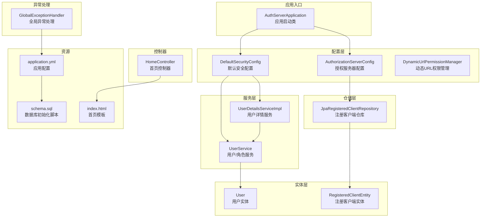

**图表来源**
- [AuthServerApplication.java:1-14](file://src/main/java/com/example/authserver/AuthServerApplication.java#L1-L14)
- [AuthorizationServerConfig.java:1-256](file://src/main/java/com/example/authserver/config/AuthorizationServerConfig.java#L1-L256)
- [DefaultSecurityConfig.java:1-75](file://src/main/java/com/example/authserver/config/DefaultSecurityConfig.java#L1-L75)
- [DynamicUrlPermissionManager.java:1-120](file://src/main/java/com/example/authserver/config/DynamicUrlPermissionManager.java#L1-L120)
- [JpaRegisteredClientRepository.java:1-289](file://src/main/java/com/example/authserver/repository/JpaRegisteredClientRepository.java#L1-L289)
- [UserDetailsServiceImpl.java:1-59](file://src/main/java/com/example/authserver/service/UserDetailsServiceImpl.java#L1-L59)
- [UserService.java:1-265](file://src/main/java/com/example/authserver/service/UserService.java#L1-L265)
- [User.java:1-66](file://src/main/java/com/example/authserver/entity/User.java#L1-L66)
- [RegisteredClientEntity.java:1-111](file://src/main/java/com/example/authserver/entity/RegisteredClientEntity.java#L1-L111)
- [HomeController.java:1-24](file://src/main/java/com/example/authserver/controller/HomeController.java#L1-L24)
- [GlobalExceptionHandler.java:1-130](file://src/main/java/com/example/authserver/exception/GlobalExceptionHandler.java#L1-L130)
- [application.yml:1-29](file://src/main/resources/application.yml#L1-L29)
- [schema.sql:1-169](file://src/main/resources/schema.sql#L1-L169)
- [index.html:1-243](file://src/main/resources/templates/index.html#L1-L243)

**章节来源**
- [pom.xml:1-147](file://pom.xml#L1-L147)
- [application.yml:1-29](file://src/main/resources/application.yml#L1-L29)

## 核心组件
- 授权服务器配置：启用 OAuth2 Authorization Server 默认安全、OpenID Connect 支持、JWT 解码器、JDBC 授权服务与授权确认服务、JWK 源与授权服务器设置。
- 默认安全配置：配置认证提供者、密码编码器、表单登录与登出、以及基于动态 URL 权限管理器的请求授权。
- 动态 URL 权限管理：从数据库加载 URL 权限规则，支持 ANT 风格路径匹配、HTTP 方法匹配、优先级排序与缓存。
- 注册客户端仓库：基于 JPA 的 RegisteredClientRepository 实现，负责客户端配置的持久化与查询。
- 用户详情服务：实现 UserDetailsService，将数据库用户映射为 Spring Security 用户详情。
- 用户服务：提供用户与角色的 CRUD、角色分配、权限统计等能力。
- 实体模型：用户、角色、URL 权限、注册客户端等，对应 schema.sql 中的数据库表结构。
- 控制器与模板：首页控制器与 Thymeleaf 模板，展示登录成功后的欢迎页面与管理入口。
- 全局异常处理：统一处理常见异常，输出结构化错误响应。

**章节来源**
- [AuthorizationServerConfig.java:1-256](file://src/main/java/com/example/authserver/config/AuthorizationServerConfig.java#L1-L256)
- [DefaultSecurityConfig.java:1-75](file://src/main/java/com/example/authserver/config/DefaultSecurityConfig.java#L1-L75)
- [DynamicUrlPermissionManager.java:1-120](file://src/main/java/com/example/authserver/config/DynamicUrlPermissionManager.java#L1-L120)
- [JpaRegisteredClientRepository.java:1-289](file://src/main/java/com/example/authserver/repository/JpaRegisteredClientRepository.java#L1-L289)
- [UserDetailsServiceImpl.java:1-59](file://src/main/java/com/example/authserver/service/UserDetailsServiceImpl.java#L1-L59)
- [UserService.java:1-265](file://src/main/java/com/example/authserver/service/UserService.java#L1-L265)
- [User.java:1-66](file://src/main/java/com/example/authserver/entity/User.java#L1-L66)
- [RegisteredClientEntity.java:1-111](file://src/main/java/com/example/authserver/entity/RegisteredClientEntity.java#L1-L111)
- [HomeController.java:1-24](file://src/main/java/com/example/authserver/controller/HomeController.java#L1-L24)
- [GlobalExceptionHandler.java:1-130](file://src/main/java/com/example/authserver/exception/GlobalExceptionHandler.java#L1-L130)

## 架构总览
本项目采用分层架构，结合 Spring Security OAuth2 Authorization Server 与 Spring MVC/Thymeleaf，形成“认证中心 + 动态权限 + 客户端管理”的完整方案。核心流程包括：
- 授权服务器安全过滤链：应用默认 OAuth2 安全配置，启用 OIDC，配置异常处理与资源服务器 JWT。
- 客户端生命周期：通过 RegisteredClientRepository 管理客户端配置，支持授权码、刷新令牌、客户端凭证等多种授权类型。
- 用户认证与授权：通过 UserDetailsServiceImpl 加载用户详情，结合动态 URL 权限管理器进行细粒度访问控制。
- 数据持久化：JPA 实体与 schema.sql 定义用户、角色、URL 权限、注册客户端等表结构；JdbcOAuth2AuthorizationService 与 JdbcOAuth2AuthorizationConsentService 存储授权状态与授权同意。

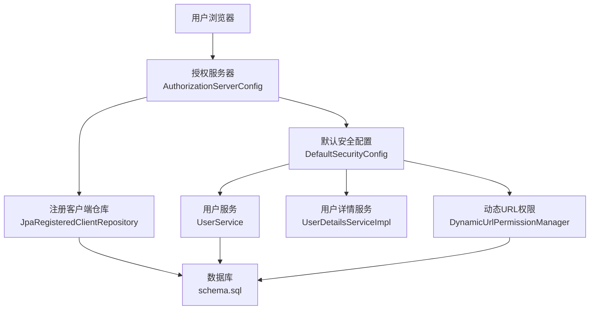

**图表来源**
- [AuthorizationServerConfig.java:56-77](file://src/main/java/com/example/authserver/config/AuthorizationServerConfig.java#L56-L77)
- [DefaultSecurityConfig.java:55-73](file://src/main/java/com/example/authserver/config/DefaultSecurityConfig.java#L55-L73)
- [DynamicUrlPermissionManager.java:23-81](file://src/main/java/com/example/authserver/config/DynamicUrlPermissionManager.java#L23-L81)
- [JpaRegisteredClientRepository.java:21-88](file://src/main/java/com/example/authserver/repository/JpaRegisteredClientRepository.java#L21-L88)
- [UserService.java:24-104](file://src/main/java/com/example/authserver/service/UserService.java#L24-L104)
- [UserDetailsServiceImpl.java:22-58](file://src/main/java/com/example/authserver/service/UserDetailsServiceImpl.java#L22-L58)
- [schema.sql:8-169](file://src/main/resources/schema.sql#L8-L169)

## 详细组件分析

### 授权服务器配置（AuthorizationServerConfig）
- 安全过滤链：应用 OAuth2 默认安全配置，启用 OIDC，配置 HTML 请求的登录入口与资源服务器 JWT。
- 客户端初始化：在应用启动时初始化 Web 应用、移动端与后端服务三类客户端，分别配置授权类型、重定向 URI、作用域、授权同意与 PKCE 等策略。
- 授权服务与授权确认：使用 JDBC 实现授权状态与授权同意的持久化。
- JWK 与 JWT：生成 RSA 密钥对，构建 JWK Set 并配置 JwtDecoder 以签发与校验 JWT。
- 授权服务器设置：提供 AuthorizationServerSettings。

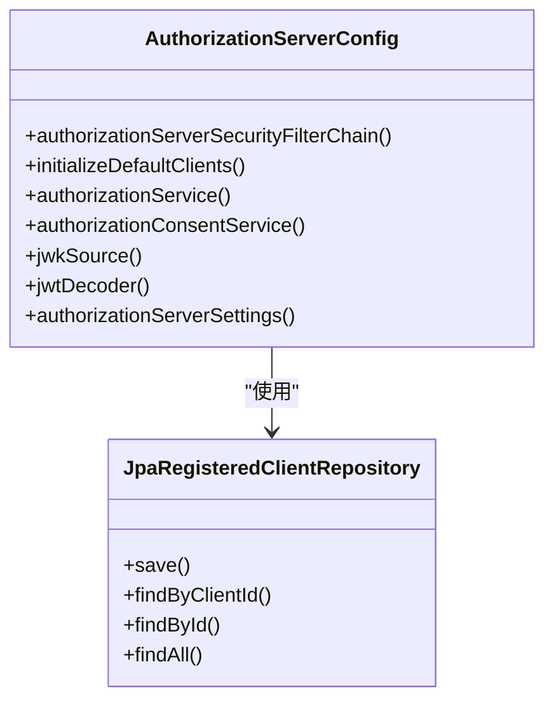

**图表来源**
- [AuthorizationServerConfig.java:56-253](file://src/main/java/com/example/authserver/config/AuthorizationServerConfig.java#L56-L253)
- [JpaRegisteredClientRepository.java:29-88](file://src/main/java/com/example/authserver/repository/JpaRegisteredClientRepository.java#L29-L88)

**章节来源**
- [AuthorizationServerConfig.java:56-253](file://src/main/java/com/example/authserver/config/AuthorizationServerConfig.java#L56-L253)

### 默认安全配置（DefaultSecurityConfig）
- 认证提供者：基于数据库用户详情的 DaoAuthenticationProvider。
- 密码编码器：使用 DelegatingPasswordEncoder。
- 安全过滤链：允许静态资源与公开端点访问，其余请求均需认证；表单登录成功跳转首页，登出后回到登录页。

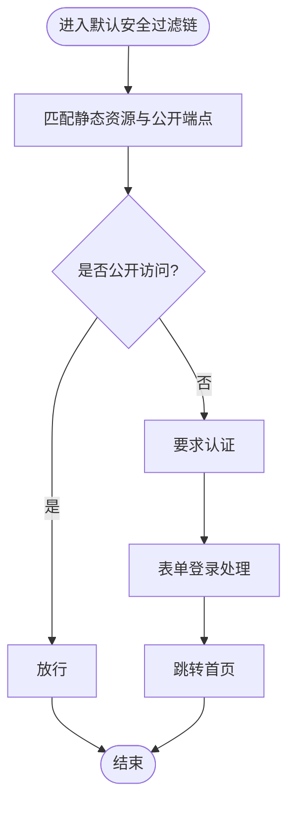

**图表来源**
- [DefaultSecurityConfig.java:55-73](file://src/main/java/com/example/authserver/config/DefaultSecurityConfig.java#L55-L73)

**章节来源**
- [DefaultSecurityConfig.java:34-73](file://src/main/java/com/example/authserver/config/DefaultSecurityConfig.java#L34-L73)

### 动态 URL 权限管理（DynamicUrlPermissionManager）
- 初始化：启动时从数据库加载所有启用的 URL 权限规则并缓存。
- 匹配逻辑：按优先级排序，使用 AntPathMatcher 匹配 URL 与 HTTP 方法，检查用户角色是否满足所需角色。
- 缓存与热更新：提供 reloadPermissions、addPermission、removePermission 等方法，支持运行时更新权限规则。

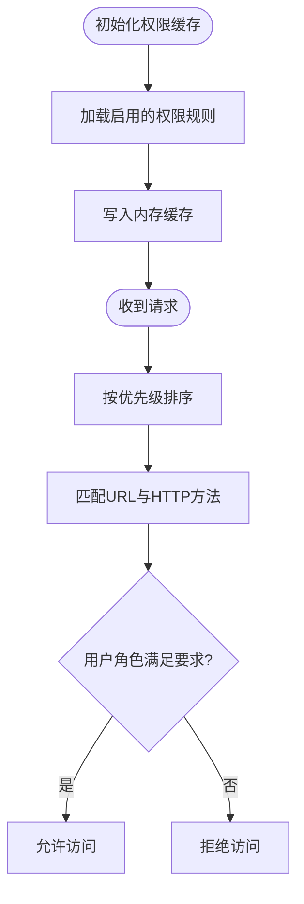

**图表来源**
- [DynamicUrlPermissionManager.java:36-95](file://src/main/java/com/example/authserver/config/DynamicUrlPermissionManager.java#L36-L95)

**章节来源**
- [DynamicUrlPermissionManager.java:23-120](file://src/main/java/com/example/authserver/config/DynamicUrlPermissionManager.java#L23-L120)

### 注册客户端仓库（JpaRegisteredClientRepository）
- 保存与更新：支持根据 clientId 查找并合并更新，统一使用 merge 保证新增与更新的一致性。
- 类型转换：RegisteredClient 与 RegisteredClientEntity 之间的双向转换，处理时间类型与集合字段。
- 查询：支持按 clientId、id 查询，以及列出所有客户端。

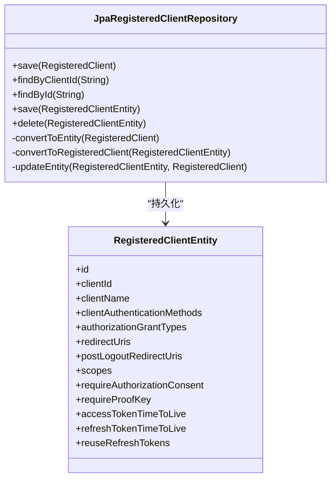

**图表来源**
- [JpaRegisteredClientRepository.java:29-287](file://src/main/java/com/example/authserver/repository/JpaRegisteredClientRepository.java#L29-L287)
- [RegisteredClientEntity.java:14-110](file://src/main/java/com/example/authserver/entity/RegisteredClientEntity.java#L14-L110)

**章节来源**
- [JpaRegisteredClientRepository.java:21-289](file://src/main/java/com/example/authserver/repository/JpaRegisteredClientRepository.java#L21-L289)

### 用户详情服务（UserDetailsServiceImpl）
- 用户加载：根据用户名从 UserService 获取用户，转换为 Spring Security 的 UserDetails，包含用户名、密码、启用状态与角色权限。
- 异常处理：捕获加载失败并抛出 UsernameNotFoundException。

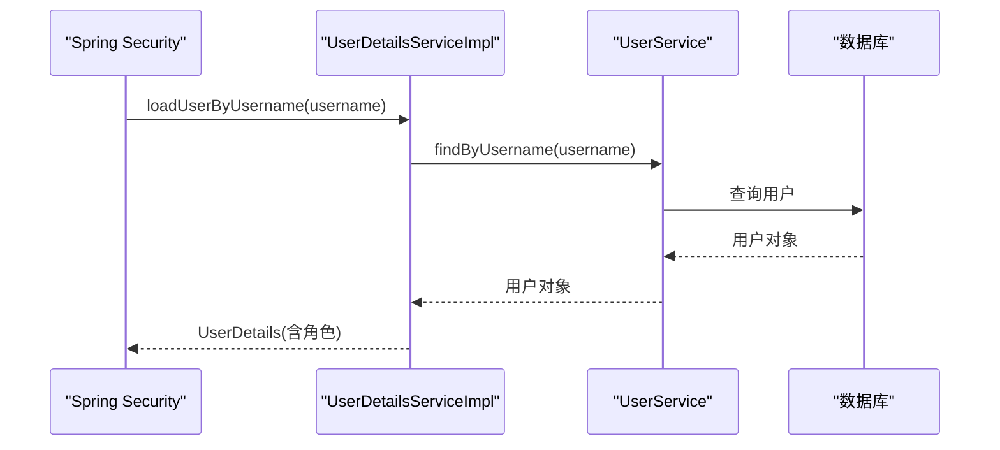

**图表来源**
- [UserDetailsServiceImpl.java:29-57](file://src/main/java/com/example/authserver/service/UserDetailsServiceImpl.java#L29-L57)
- [UserService.java:39-42](file://src/main/java/com/example/authserver/service/UserService.java#L39-L42)

**章节来源**
- [UserDetailsServiceImpl.java:22-58](file://src/main/java/com/example/authserver/service/UserDetailsServiceImpl.java#L22-L58)

### 用户服务（UserService）
- 用户管理：创建、更新、删除用户，支持分配角色与默认角色分配。
- 角色管理：创建、删除、更新角色描述，统计每个角色的用户数量。
- 参数校验与异常：对用户名、密码长度、角色存在性进行校验，抛出相应异常。

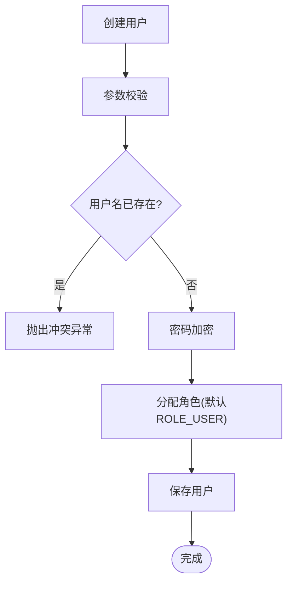

**图表来源**
- [UserService.java:58-104](file://src/main/java/com/example/authserver/service/UserService.java#L58-L104)

**章节来源**
- [UserService.java:24-265](file://src/main/java/com/example/authserver/service/UserService.java#L24-L265)

### 实体模型（User 与 RegisteredClientEntity）
- User：包含 id、username、password、enabled、创建与更新时间戳，以及与 Role 的多对多关联。
- RegisteredClientEntity：扁平化存储 RegisteredClient 的所有字段，便于直接映射到 oauth2_registered_client 表。

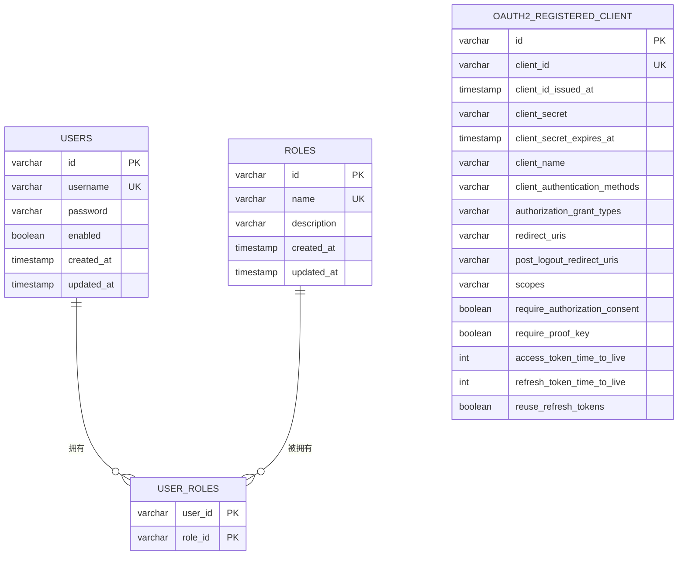

**图表来源**
- [User.java:20-66](file://src/main/java/com/example/authserver/entity/User.java#L20-L66)
- [RegisteredClientEntity.java:11-110](file://src/main/java/com/example/authserver/entity/RegisteredClientEntity.java#L11-L110)
- [schema.sql:8-169](file://src/main/resources/schema.sql#L8-L169)

**章节来源**
- [User.java:17-66](file://src/main/java/com/example/authserver/entity/User.java#L17-L66)
- [RegisteredClientEntity.java:8-111](file://src/main/java/com/example/authserver/entity/RegisteredClientEntity.java#L8-L111)

### 控制器与模板（HomeController 与 index.html）
- HomeController：首页控制器，向模板传递当前登录用户名。
- index.html：Thymeleaf 模板，展示欢迎信息、管理员入口、OIDC 发现文档链接与登出表单，集成 Spring Security 标签进行权限控制。

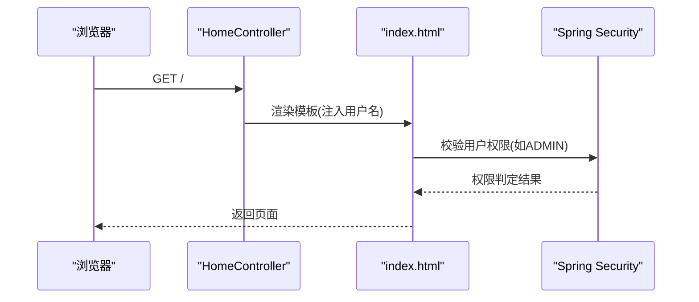

**图表来源**
- [HomeController.java:15-21](file://src/main/java/com/example/authserver/controller/HomeController.java#L15-L21)
- [index.html:194-231](file://src/main/resources/templates/index.html#L194-L231)

**章节来源**
- [HomeController.java:12-24](file://src/main/java/com/example/authserver/controller/HomeController.java#L12-L24)
- [index.html:1-243](file://src/main/resources/templates/index.html#L1-L243)

### 全局异常处理（GlobalExceptionHandler）
- 统一处理：资源不存在、资源冲突、参数验证失败、非法参数、用户名未找到、凭证错误、访问被拒绝、通用异常。
- 错误响应：返回包含时间戳、状态码与消息的结构化 JSON。

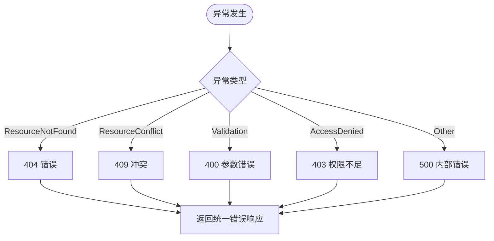

**图表来源**
- [GlobalExceptionHandler.java:28-117](file://src/main/java/com/example/authserver/exception/GlobalExceptionHandler.java#L28-L117)

**章节来源**
- [GlobalExceptionHandler.java:21-130](file://src/main/java/com/example/authserver/exception/GlobalExceptionHandler.java#L21-L130)

## 依赖分析
项目使用 Spring Boot 3.2.3 与 Java 17，核心依赖包括：
- spring-boot-starter-oauth2-authorization-server：OAuth2 授权服务器核心
- spring-boot-starter-security：Spring Security
- spring-boot-starter-web：Web 层
- spring-boot-starter-data-jpa：JPA 持久化
- spring-boot-starter-thymeleaf：模板引擎
- thymeleaf-extras-springsecurity6：Thymeleaf 与 Spring Security 集成
- mysql-connector-j：MySQL 驱动
- devtools/lombok/configuration-processor/test：开发与测试辅助

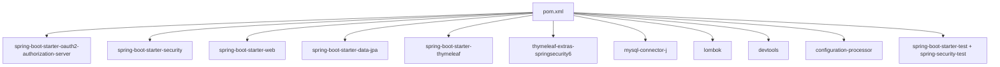

**图表来源**
- [pom.xml:29-114](file://pom.xml#L29-L114)

**章节来源**
- [pom.xml:1-147](file://pom.xml#L1-L147)

## 性能考虑
- 数据库初始化：通过 schema.sql 与 application.yml 的 SQL 初始化配置，确保首次启动时自动创建表结构与默认数据。
- JPA 与 Hibernate：开启 SQL 日志与格式化，便于调试与性能分析；DDL 自动更新适合开发环境，生产建议手动迁移。
- 缓存与匹配：动态 URL 权限管理器使用并发 Map 缓存规则，AntPathMatcher 进行高效路径匹配，减少每次请求的数据库查询。
- 客户端配置：RegisteredClientRepository 使用 merge 统一持久化逻辑，避免重复保存与事务开销。
- JWT 签发：RSA 2048 位密钥对生成 JWK，建议在生产环境使用硬件安全模块（HSM）或外部密钥管理服务。

[本节为通用指导，无需具体文件引用]

## 故障排除指南
- 认证失败：检查用户名与密码是否正确，确认用户启用状态与角色分配；查看全局异常处理对 BadCredentialsException 的统一响应。
- 权限不足：确认请求 URL 是否匹配动态权限规则，检查用户角色与所需角色；查看日志中权限匹配结果。
- 客户端配置问题：确认 RegisteredClient 的授权类型、重定向 URI、作用域与 PKCE 设置；检查 JdbcOAuth2AuthorizationService 的授权状态存储。
- 数据库连接：核对 application.yml 中的数据库 URL、用户名与密码，确认 MySQL 服务可用且驱动版本兼容。
- OIDC 发现：访问 /.well-known/openid-configuration 端点，确认授权服务器配置正确。

**章节来源**
- [GlobalExceptionHandler.java:78-106](file://src/main/java/com/example/authserver/exception/GlobalExceptionHandler.java#L78-L106)
- [application.yml:5-9](file://src/main/resources/application.yml#L5-L9)
- [AuthorizationServerConfig.java:62-74](file://src/main/java/com/example/authserver/config/AuthorizationServerConfig.java#L62-L74)

## 结论
本项目以 Spring Security OAuth2 Authorization Server 为核心，结合动态 URL 权限管理与完善的用户/角色体系，构建了功能完备的认证中心。其支持 OAuth2 授权码模式与 OpenID Connect 1.0，适用于单点登录与 API 安全保护场景，并可通过注册客户端仓库灵活管理各类客户端。配合 Thymeleaf 模板与全局异常处理，项目具备良好的可维护性与扩展性。

[本节为总结性内容，无需具体文件引用]

## 附录
- 应用配置：端口、数据源、Thymeleaf、SQL 初始化、JPA 设置与日志级别。
- 数据库脚本：用户、角色、URL 权限、注册客户端、授权与授权同意表的建表与初始化数据。
- 技术栈优势：Spring Boot 3.2.3 提供现代化特性与性能优化；Java 17 支持长期支持与性能改进；MySQL 提供成熟的关系型数据存储；JPA/Thymeleaf 简化持久化与视图开发。

**章节来源**
- [application.yml:1-29](file://src/main/resources/application.yml#L1-L29)
- [schema.sql:1-169](file://src/main/resources/schema.sql#L1-L169)
- [pom.xml:24-26](file://pom.xml#L24-L26)